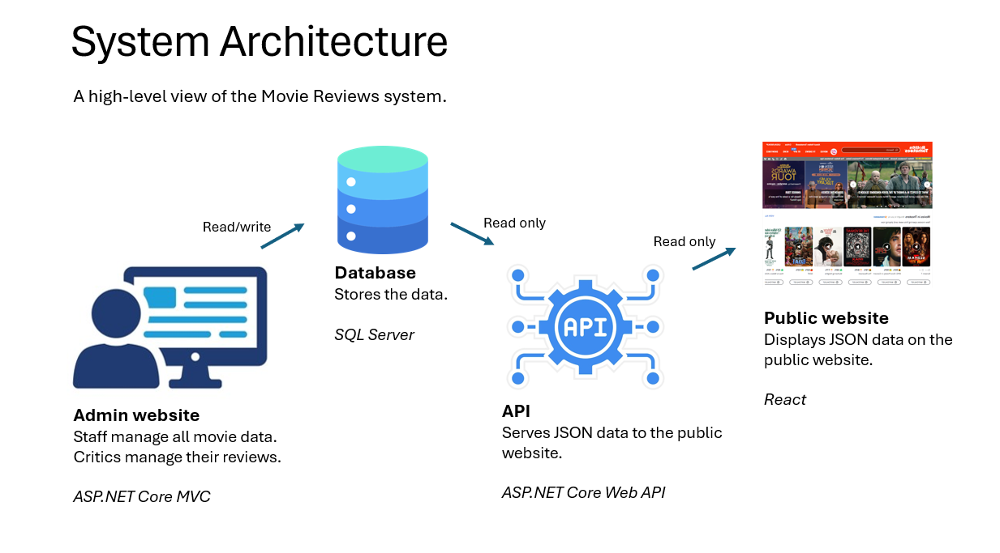

# Movies Admin - Rotten Tomatoes;

This website will be for staff to manage all movie data as well as critics to manage reviews
---
## Overall Features
- Admin Website: ASP.NET Core MVC
- CRUD operations
- Manage Movie Data
- Critics Manage Reviews
- Backend API: ASP.NET Core Web API
- Authentication: Secure Admin login and registaction
- Database: SQL Server
- (More being added)

---
## Overall Tech Stack
- Admin Website: C#
- Runtime: NA
- Language: NA
- Frontend: React
- Database: SQL Server
- (More being added)

---

## How this fits into the larger system

This Websites is not going to be accessible by the public, only authorize personnel will be able to log in after proper certification. The goal of "Movies Admin" is for staff to preform managerial operations towards data throughout the entire website. This data after being managed though CRUD operations will then be sent out to the database, then to an API and finnaly to a public website which is where the main services will be provided. You can view a visual diagram below.

---

## Basic Overall System Architecture

Admin (Read/Write) -> Database (Read Only) -> API(Read Only) -> Public website

---
## License
TODO
